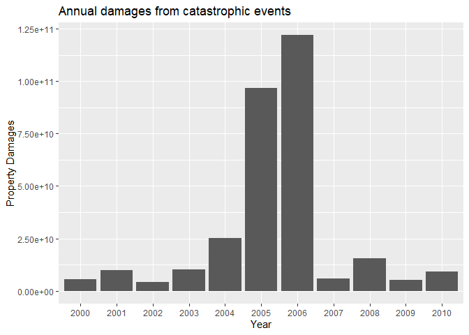
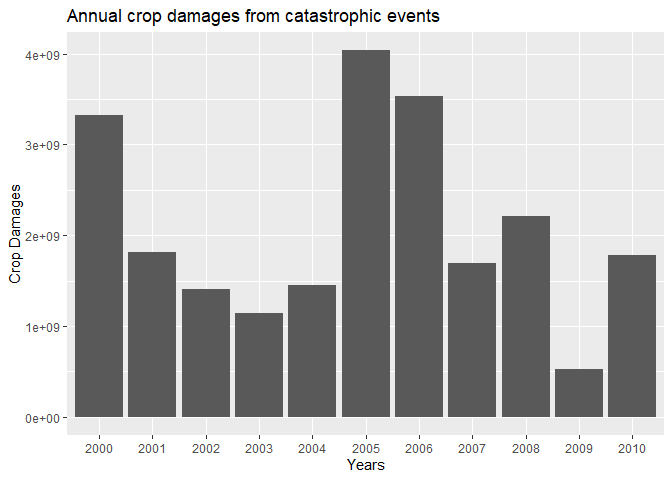
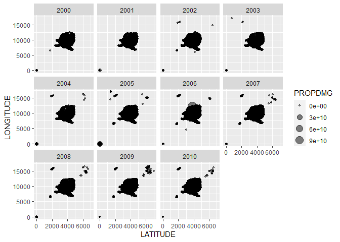
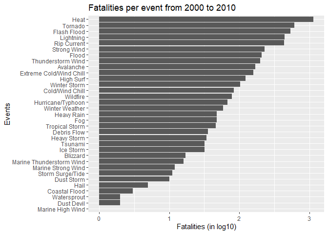
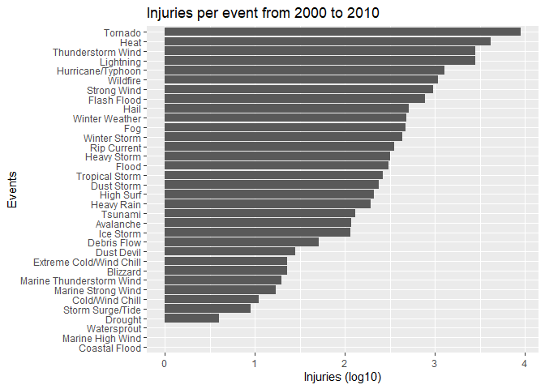
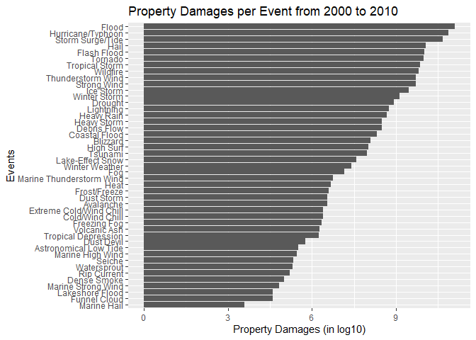
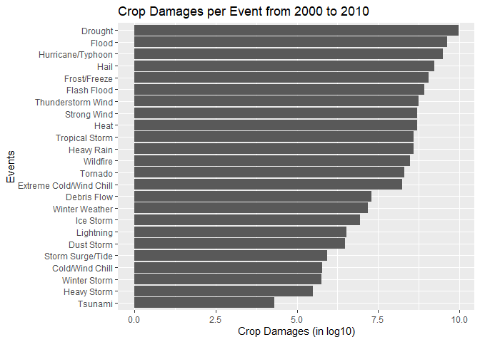

Identifying the most impactful catastrophic events in the US (2000-2010)
================

<br>

## Synopsis

In this study, we try to identify which **catastrophic event** has been
the most impactful in terms of **population health** and **economy**. We
had worked on the **storm database** of U.S. **National Oceanic and
Atmospheric Administration (NOAA)**. This includes information on when
and where the event occurred, and the estimated fatalities, injuries and
property damages. The data has **902,297** observations and **37**
variables. This dataset contains data of the catastrophic events from
**1950** to **2011**. The coverage of this study is only the data from
**2000** to **2010**.

What I’ve learned from this analysis is that **Heat**, **Tornado**, and
**Flash Flood** (in order) are the events that killed the most number of
people from **2000** until **2010**. **Tornado** and **Heat** are also
the events that injured the most number of people.

In terms of economic impact, particularly on property, **Flood**,
**Hurricane/Typhoon**, and **Storm Surge/Tide** have damaged the most
properties. For crop damages, **Drought** had been the event that
destroyed the most number of crops. It’s followed by **Flood** and
**Hurricane/Typhoon**.

<br>

## Source code

For the simplicity of this report, I have written a script called
`storm_analysis.R` and sourced it. The functions in that script are the
ones that I used to get the results I need for this study, particularly,
more on the data wrangling part. It’s available in my
[Github](https://github.com/imjbmkz/r_repository/blob/master/Storm%20Analysis%20NOAA/storm_analysis.R)
repository.

``` r
source('storm_analysis.R')
```

    ## 
    ## Attaching package: 'lubridate'

    ## The following objects are masked from 'package:base':
    ## 
    ##     date, intersect, setdiff, union

    ## 
    ## Attaching package: 'dplyr'

    ## The following objects are masked from 'package:stats':
    ## 
    ##     filter, lag

    ## The following objects are masked from 'package:base':
    ## 
    ##     intersect, setdiff, setequal, union

<br>

## Loading the data

From the original
[storm](https://d396qusza40orc.cloudfront.net/repdata%2Fdata%2FStormData.csv.bz2)
dataset, we only extracted the **2000** to **2010** data. The source of
the data is in `.bz2` format to compress the file and reduce its size.
I’ve converted it into a `.feather` format for
efficiency<sup>\[1\]</sup>. Below are the functions in
`storm_analysis.R` script that imports and filters the data based on
this study’s coverage.

``` r
storm <- get_data()
storm <- get_coverage(storm)
str(storm)
```

    ## tibble [460,989 x 38] (S3: tbl_df/tbl/data.frame)
    ##  $ STATE__   : num [1:460989] 1 1 1 1 1 1 1 1 1 1 ...
    ##  $ BGN_DATE  : Date[1:460989], format: "2000-02-13" "2000-02-13" ...
    ##  $ BGN_TIME  : chr [1:460989] "06:09:00 PM" "06:15:00 PM" "06:24:00 PM" "06:35:00 PM" ...
    ##  $ TIME_ZONE : chr [1:460989] "CST" "CST" "CST" "CST" ...
    ##  $ COUNTY    : num [1:460989] 77 77 33 75 93 133 133 127 79 83 ...
    ##  $ COUNTYNAME: chr [1:460989] "LAUDERDALE" "LAUDERDALE" "COLBERT" "LAMAR" ...
    ##  $ STATE     : chr [1:460989] "AL" "AL" "AL" "AL" ...
    ##  $ EVTYPE    : chr [1:460989] "TSTM WIND" "TSTM WIND" "TSTM WIND" "TSTM WIND" ...
    ##  $ BGN_RANGE : num [1:460989] 0 0 0 0 0 0 0 0 0 0 ...
    ##  $ BGN_AZI   : chr [1:460989] "" "" "" "" ...
    ##  $ BGN_LOCATI: chr [1:460989] "KILLEN" "ROGERSVILLE" "SHEFFIELD" "VERNON" ...
    ##  $ END_DATE  : chr [1:460989] "2/13/2000 0:00:00" "2/13/2000 0:00:00" "2/13/2000 0:00:00" "2/13/2000 0:00:00" ...
    ##  $ END_TIME  : chr [1:460989] "06:09:00 PM" "06:15:00 PM" "06:24:00 PM" "06:35:00 PM" ...
    ##  $ COUNTY_END: num [1:460989] 0 0 0 0 0 0 0 0 0 0 ...
    ##  $ COUNTYENDN: logi [1:460989] NA NA NA NA NA NA ...
    ##  $ END_RANGE : num [1:460989] 0 0 0 0 0 0 0 0 0 0 ...
    ##  $ END_AZI   : chr [1:460989] "" "" "" "" ...
    ##  $ END_LOCATI: chr [1:460989] "KILLEN" "ROGERSVILLE" "SHEFFIELD" "VERNON" ...
    ##  $ LENGTH    : num [1:460989] 0 0 0 0 0 0 0 0 0 0 ...
    ##  $ WIDTH     : num [1:460989] 0 0 0 0 0 0 0 0 0 0 ...
    ##  $ F         : int [1:460989] NA NA NA NA NA NA NA NA NA NA ...
    ##  $ MAG       : num [1:460989] 55 55 60 60 55 275 60 60 60 55 ...
    ##  $ FATALITIES: num [1:460989] 0 0 0 0 0 0 0 0 0 0 ...
    ##  $ INJURIES  : num [1:460989] 0 0 0 0 0 0 0 0 0 0 ...
    ##  $ PROPDMG   : num [1:460989] 20 20 2 5 2 5 4 30 20 25 ...
    ##  $ PROPDMGEXP: chr [1:460989] "K" "K" "K" "K" ...
    ##  $ CROPDMG   : num [1:460989] 0 0 0 0 0 0 0 0 0 0 ...
    ##  $ CROPDMGEXP: chr [1:460989] "K" "K" "K" "K" ...
    ##  $ WFO       : chr [1:460989] "BMX" "BMX" "BMX" "BMX" ...
    ##  $ STATEOFFIC: chr [1:460989] "ALABAMA, Central" "ALABAMA, Central" "ALABAMA, Central" "ALABAMA, Central" ...
    ##  $ ZONENAMES : chr [1:460989] "" "" "" "" ...
    ##  $ LATITUDE  : num [1:460989] 3452 3450 3446 3345 3401 ...
    ##  $ LONGITUDE : num [1:460989] 8732 8717 8742 8807 8746 ...
    ##  $ LATITUDE_E: num [1:460989] 3452 3450 3446 3345 3401 ...
    ##  $ LONGITUDE_: num [1:460989] 8732 8717 8742 8807 8746 ...
    ##  $ REMARKS   : chr [1:460989] "Numerous trees and power lines were blown down near Killen.\n" "Numerous trees and power lines were knocked down in the Rogersville area.\n" "Several trees were blown down in Sheffield\n" "Trees were blown down in and around the city of Vernon.\n" ...
    ##  $ REFNUM    : num [1:460989] 379210 379211 379212 379213 379214 ...
    ##  $ BGN_YEAR  : num [1:460989] 2000 2000 2000 2000 2000 2000 2000 2000 2000 2000 ...

The dataset now has **38** columns because `get_coverage()` function
mutates the data with `BGN_YEAR`. `BGN_DATE` variable was converted to
`Date` object, and the year was taken from it. Then, in this same
function, the data was then filtered by `BGN_YEAR` with values ranging
from 2000 to 2010.

From the above structure, we can see all variables listed, their
corresponding type, length, and some sample values. This
[document](https://d396qusza40orc.cloudfront.net/repdata%2Fpeer2_doc%2Fpd01016005curr.pdf)
gives us comprehensive details and explanation regarding these
variables.

<br>

## Data Preprocessing

### Selecting Variables

By looking at the structure of the data from the previous section, we
could notice some variables which are deemed “*irrelevant*” in the
actual analysis. These variables are `STATE__`, `COUNTY`, `WFO`,
`STATEOFFIC`, `ZONENAMES`, `REMARKS`, and `REFNUM`. These variables are
more of free text values and identifier of the record. The variables
related to **azimuth** and **range** will also not be included as these
are technical measures that are only for marine zones<sup>\[2\]</sup>.
Location that are of character values, `TIME_ZONE`, `LENGTH`, `WIDTH`,
`MAG`, and `F` will also be removed from the data to just focus on the
goal of this study. I also removed `LATITUDE_E` and `LONGITUDE_` since
they are the ending geographic coordinates of an event. I’m only
interested in the starting points. I have a function that removes these
columns from our data.

``` r
storm <- rem_excols(storm)
str(storm)
```

    ## tibble [460,989 x 16] (S3: tbl_df/tbl/data.frame)
    ##  $ BGN_DATE  : Date[1:460989], format: "2000-02-13" "2000-02-13" ...
    ##  $ BGN_TIME  : chr [1:460989] "06:09:00 PM" "06:15:00 PM" "06:24:00 PM" "06:35:00 PM" ...
    ##  $ COUNTYNAME: chr [1:460989] "LAUDERDALE" "LAUDERDALE" "COLBERT" "LAMAR" ...
    ##  $ STATE     : chr [1:460989] "AL" "AL" "AL" "AL" ...
    ##  $ EVTYPE    : chr [1:460989] "TSTM WIND" "TSTM WIND" "TSTM WIND" "TSTM WIND" ...
    ##  $ END_DATE  : chr [1:460989] "2/13/2000 0:00:00" "2/13/2000 0:00:00" "2/13/2000 0:00:00" "2/13/2000 0:00:00" ...
    ##  $ END_TIME  : chr [1:460989] "06:09:00 PM" "06:15:00 PM" "06:24:00 PM" "06:35:00 PM" ...
    ##  $ FATALITIES: num [1:460989] 0 0 0 0 0 0 0 0 0 0 ...
    ##  $ INJURIES  : num [1:460989] 0 0 0 0 0 0 0 0 0 0 ...
    ##  $ PROPDMG   : num [1:460989] 20 20 2 5 2 5 4 30 20 25 ...
    ##  $ PROPDMGEXP: chr [1:460989] "K" "K" "K" "K" ...
    ##  $ CROPDMG   : num [1:460989] 0 0 0 0 0 0 0 0 0 0 ...
    ##  $ CROPDMGEXP: chr [1:460989] "K" "K" "K" "K" ...
    ##  $ LATITUDE  : num [1:460989] 3452 3450 3446 3345 3401 ...
    ##  $ LONGITUDE : num [1:460989] 8732 8717 8742 8807 8746 ...
    ##  $ BGN_YEAR  : num [1:460989] 2000 2000 2000 2000 2000 2000 2000 2000 2000 2000 ...

<br>

### Handling Missing Values

Let’s now check if the data consists of blank rows. I have a pre-defined
function to check the rate of `NA`s in our data.

``` r
sapply(storm, na_rate)
```

    ##     BGN_DATE     BGN_TIME   COUNTYNAME        STATE       EVTYPE     END_DATE 
    ## 0.000000e+00 0.000000e+00 0.000000e+00 0.000000e+00 0.000000e+00 0.000000e+00 
    ##     END_TIME   FATALITIES     INJURIES      PROPDMG   PROPDMGEXP      CROPDMG 
    ## 0.000000e+00 0.000000e+00 0.000000e+00 0.000000e+00 0.000000e+00 0.000000e+00 
    ##   CROPDMGEXP     LATITUDE    LONGITUDE     BGN_YEAR 
    ## 0.000000e+00 9.544696e-05 0.000000e+00 0.000000e+00

There’s only a very small portion of blank values in every column. So,
for ease of analysis, let’s just drop these rows<sup>\[3\]</sup>.

``` r
print(paste0('Current Rows: ', nrow(storm)))
```

    ## [1] "Current Rows: 460989"

``` r
storm <- storm[complete.cases(storm), ]
print(paste0('New Rows: ', nrow(storm)))
```

    ## [1] "New Rows: 460945"

<br>

### Data Wrangling

This is the crucial part of this study. The `EVTYPE` variable, which
represents the type of the event that occurred, is quite problematic.
Let’s print out the number of unique values from this variable.

``` r
print(paste0('There are ', length(unique(storm$EVTYPE)), ' unique values in this column.'))
```

    ## [1] "There are 196 unique values in this column."

So there are **196 unique** values. But looking at the [**Storm Data
Preparation**](https://d396qusza40orc.cloudfront.net/repdata%2Fpeer2_doc%2Fpd01016005curr.pdf)
document, there are only **48** unique event names. So obviously, there
are errors on the data. We can’t say if these entries are free from
**misclassification** but one thing we can say is that the data had typo
errors.

The approach that I did to map these entries with the standard naming
convention is to use **regular expressions** within R to identify
patterns that could fit the standard event type. But when I looked at
these 196 values, they still differ in many ways. I relied on the Storm
Data Preparation document to see which words in these entries matched
with the description of the specified event type. Somehow, there are
some manual input in the function that I wrote to clean the event types.
Frankly speaking, some of the entries were generalized to classify it
with the standard event type (ie. if there’s a word `snow`, it’ll be
classified as `Heavy Snow`). Lastly, I marked those entries that I can’t
really decipher as `Unsure`, and will be removed from the analytic
data<sup>\[4\]</sup>.

Here’s the line of code that cleans up `EVTYPE` variable. The function
is called `clean_events()` which is part of the `storm_analysis.R`
script.

``` r
storm$EVTYPE <- clean_events(storm$EVTYPE)
storm <- storm %>% filter(EVTYPE != 'Unsure')
print(paste0('There are now ', length(unique(storm$EVTYPE)), ' unique values in this variable.'))
```

    ## [1] "There are now 46 unique values in this variable."

<br>

The next part of the data wrangling stage is to manipulate the variables
for **property** and **crop damages** which are denoted by `PROPDMG` and
`CROPDMG`. They have a corresponding exponential value which are denoted
by `PROPDMGEXP` and `CROPDMGEXP` respectively. These columns for
exponent values of the damages consist of some characters and letters
that represent a specific mutiplier. See table below.

| Value   | Description | Multiplier    |
| ------- | ----------- | ------------- |
| `H`,`h` | hundreds    | 100           |
| `K`,`k` | kilos       | 1,000         |
| `M`,`m` | millions    | 1,000,000     |
| `B`,`b` | billions    | 1,000,000,000 |
| (`+`)   | \-          | 1             |
| (`-`)   | \-          | 0             |
| (`?`)   | \-          | 0             |
| `0-8`   | \-          | 10            |

We will need to get the actual amount of damages on properties and
crops. I have a function called `get_exp_val()` that translates these
character vectors into numeric for us to use it as multiplier to
`PROPDMG` and `CROPDMG` columns.

``` r
storm <- storm %>% mutate(
  PROPDMGEXP = get_exp_val(PROPDMGEXP), CROPDMGEXP = get_exp_val(CROPDMGEXP),
  PROPDMG = PROPDMG * PROPDMGEXP, CROPDMG = CROPDMG * CROPDMGEXP) %>% 
  select(-c(PROPDMGEXP, CROPDMGEXP))
str(storm)
```

    ## tibble [460,934 x 14] (S3: tbl_df/tbl/data.frame)
    ##  $ BGN_DATE  : Date[1:460934], format: "2000-02-13" "2000-02-13" ...
    ##  $ BGN_TIME  : chr [1:460934] "06:09:00 PM" "06:15:00 PM" "06:24:00 PM" "06:35:00 PM" ...
    ##  $ COUNTYNAME: chr [1:460934] "LAUDERDALE" "LAUDERDALE" "COLBERT" "LAMAR" ...
    ##  $ STATE     : chr [1:460934] "AL" "AL" "AL" "AL" ...
    ##  $ EVTYPE    : chr [1:460934] "Thunderstorm Wind" "Thunderstorm Wind" "Thunderstorm Wind" "Thunderstorm Wind" ...
    ##  $ END_DATE  : chr [1:460934] "2/13/2000 0:00:00" "2/13/2000 0:00:00" "2/13/2000 0:00:00" "2/13/2000 0:00:00" ...
    ##  $ END_TIME  : chr [1:460934] "06:09:00 PM" "06:15:00 PM" "06:24:00 PM" "06:35:00 PM" ...
    ##  $ FATALITIES: num [1:460934] 0 0 0 0 0 0 0 0 0 0 ...
    ##  $ INJURIES  : num [1:460934] 0 0 0 0 0 0 0 0 0 0 ...
    ##  $ PROPDMG   : num [1:460934] 20000 20000 2000 5000 2000 5000 4000 30000 20000 25000 ...
    ##  $ CROPDMG   : num [1:460934] 0 0 0 0 0 0 0 0 0 0 ...
    ##  $ LATITUDE  : num [1:460934] 3452 3450 3446 3345 3401 ...
    ##  $ LONGITUDE : num [1:460934] 8732 8717 8742 8807 8746 ...
    ##  $ BGN_YEAR  : num [1:460934] 2000 2000 2000 2000 2000 2000 2000 2000 2000 2000 ...

<br>

Let’s also manipulate the date and time columns. These are the dates
that tells when the event occurred and when it ended. It would be useful
for some time-series plotting. I’ve also added a column to get the
duration of an event.

``` r
storm <- date_parse(storm)
str(storm)
```

    ## tibble [460,934 x 16] (S3: tbl_df/tbl/data.frame)
    ##  $ COUNTYNAME   : chr [1:460934] "LAUDERDALE" "LAUDERDALE" "COLBERT" "LAMAR" ...
    ##  $ STATE        : chr [1:460934] "AL" "AL" "AL" "AL" ...
    ##  $ EVTYPE       : chr [1:460934] "Thunderstorm Wind" "Thunderstorm Wind" "Thunderstorm Wind" "Thunderstorm Wind" ...
    ##  $ FATALITIES   : num [1:460934] 0 0 0 0 0 0 0 0 0 0 ...
    ##  $ INJURIES     : num [1:460934] 0 0 0 0 0 0 0 0 0 0 ...
    ##  $ PROPDMG      : num [1:460934] 20000 20000 2000 5000 2000 5000 4000 30000 20000 25000 ...
    ##  $ CROPDMG      : num [1:460934] 0 0 0 0 0 0 0 0 0 0 ...
    ##  $ LATITUDE     : num [1:460934] 3452 3450 3446 3345 3401 ...
    ##  $ LONGITUDE    : num [1:460934] 8732 8717 8742 8807 8746 ...
    ##  $ BGN_YEAR     : num [1:460934] 2000 2000 2000 2000 2000 2000 2000 2000 2000 2000 ...
    ##  $ BGN_DATE_TIME: POSIXct[1:460934], format: "2000-02-13 06:09:00" "2000-02-13 06:15:00" ...
    ##  $ END_DATE_TIME: POSIXct[1:460934], format: "2000-02-13 06:09:00" "2000-02-13 06:15:00" ...
    ##  $ BGN_MNTH     : chr [1:460934] "February" "February" "February" "February" ...
    ##  $ END_MNTH     : chr [1:460934] "February" "February" "February" "February" ...
    ##  $ END_YEAR     : int [1:460934] 2000 2000 2000 2000 2000 2000 2000 2000 2000 2000 ...
    ##  $ EV_LENGTH    : 'difftime' num [1:460934] 0 0 0 0 ...
    ##   ..- attr(*, "units")= chr "secs"

<br>

Lastly, let’s restructure how the columns are arranged in a more logical
manner. The final output is now our **analytic data**.

``` r
storm <- arr_cols(storm)
storm
```

    ## # A tibble: 460,934 x 16
    ##    EVTYPE STATE COUNTYNAME LATITUDE LONGITUDE BGN_DATE_TIME       BGN_YEAR
    ##    <chr>  <chr> <chr>         <dbl>     <dbl> <dttm>                 <dbl>
    ##  1 Winte~ CO    COZ061 - ~        0         0 2000-01-01 02:00:00     2000
    ##  2 Heavy~ ID    IDZ005>006        0         0 2000-01-01 02:30:00     2000
    ##  3 Heavy~ MT    MTZ001>00~        0         0 2000-01-01 02:30:00     2000
    ##  4 Heavy~ OR    ORZ011            0         0 2000-01-01 07:00:00     2000
    ##  5 Blizz~ AK    AKZ001            0         0 2000-01-01 12:00:00     2000
    ##  6 Droug~ HI    HIZ003 - ~        0         0 2000-01-01 12:00:00     2000
    ##  7 Heavy~ AZ    AZZ006 - ~        0         0 2000-01-01 12:00:00     2000
    ##  8 Heavy~ CA    CAZ055>056        0         0 2000-01-01 12:00:00     2000
    ##  9 Heavy~ CO    COZ003>00~        0         0 2000-01-01 12:00:00     2000
    ## 10 Heavy~ UT    UTZ028            0         0 2000-01-01 12:00:00     2000
    ## # ... with 460,924 more rows, and 9 more variables: BGN_MNTH <chr>,
    ## #   END_DATE_TIME <dttm>, END_YEAR <int>, END_MNTH <chr>, EV_LENGTH <drtn>,
    ## #   FATALITIES <dbl>, INJURIES <dbl>, PROPDMG <dbl>, CROPDMG <dbl>

<br>

## Exploratory Data Analysis

In this portion, I just want to present some of the rough analysis
conducted for this study. It aims at further understanding the analytic
data and looking at how we could arrive at some possible findings from
it. You can skip reading this portion as exploratory data analysis is
really intended for presentation and data story telling.

<!-- -->
The above plot shows us the property damages incurred by the
catastrophic events in the US. Obviously, we can see that at around
**2005** and **2006**, we get the highest property damages. Based on the
tables below, in the year **2005**, most of these damages are because of
**Hurricane/Typhoon** and **Storm Surge/Tide**. This can be attributed
to **Hurricane Katrina** which occurred in August 2005 and caused over
$125 billion in damage<sup>\[5\]</sup>. For the year **2006**, **Flood**
has been the most damaging event that occurred. This could be because of
the 2006 **Mid-Atlantic US flooding**<sup>\[6\]</sup>

``` r
storm %>% filter(BGN_YEAR == 2005) %>% group_by(EVTYPE) %>% summarise(Property2005 = sum(PROPDMG)) %>% arrange(desc(Property2005)) %>% head()
```

    ## `summarise()` ungrouping output (override with `.groups` argument)

    ## # A tibble: 6 x 2
    ##   EVTYPE            Property2005
    ##   <chr>                    <dbl>
    ## 1 Hurricane/Typhoon  49786635000
    ## 2 Storm Surge/Tide   43058565000
    ## 3 Flood               1244483090
    ## 4 Hail                 480469230
    ## 5 Tornado              421833500
    ## 6 Thunderstorm Wind    398724100

``` r
storm %>% filter(BGN_YEAR == 2006) %>% group_by(EVTYPE) %>% summarise(Property2006 = sum(PROPDMG)) %>% arrange(desc(Property2006)) %>% head()
```

    ## `summarise()` ungrouping output (override with `.groups` argument)

    ## # A tibble: 6 x 2
    ##   EVTYPE            Property2006
    ##   <chr>                    <dbl>
    ## 1 Flood             116516105440
    ## 2 Flash Flood         2136595130
    ## 3 Hail                1300570000
    ## 4 Tornado              752273000
    ## 5 Thunderstorm Wind    407825780
    ## 6 Wildfire             179107000

<br>

We can also do the same for the crop damages.

``` r
storm %>% ggplot(aes(x = as.factor(BGN_YEAR), y = CROPDMG)) + geom_bar(stat = 'Identity') + labs(x='Years', y='Crop Damages', title = 'Annual crop damages from catastrophic events')
```

<!-- -->

``` r
print(storm %>% filter(BGN_YEAR == 2005) %>% group_by(EVTYPE) %>% summarise(Crop_2005 = sum(CROPDMG)) %>% arrange(desc(Crop_2005)) %>% head())
```

    ## `summarise()` ungrouping output (override with `.groups` argument)

    ## # A tibble: 6 x 2
    ##   EVTYPE             Crop_2005
    ##   <chr>                  <dbl>
    ## 1 Hurricane/Typhoon 2012682000
    ## 2 Drought           1311080000
    ## 3 Heavy Rain         228611000
    ## 4 Frost/Freeze       139225000
    ## 5 Tornado             82104900
    ## 6 Flood               68895000

``` r
print(storm %>% filter(BGN_YEAR == 2006) %>% group_by(EVTYPE) %>% summarise(Crop_2006 = sum(CROPDMG)) %>% arrange(desc(Crop_2006)) %>% head())
```

    ## `summarise()` ungrouping output (override with `.groups` argument)

    ## # A tibble: 6 x 2
    ##   EVTYPE      Crop_2006
    ##   <chr>           <dbl>
    ## 1 Drought    2375825000
    ## 2 Heat        492476500
    ## 3 Wildfire    232690400
    ## 4 Hail        132937000
    ## 5 Flood        95165000
    ## 6 Heavy Rain   49745000

It’s still the year 2005 and 2006 which had the most damages caused by
catastrophic events. We still had **Hurricane/Typhoon** as the major
contributor but it’s joined by **Drought** this time, which all makes
sense as these are the primary reasons of damaging crops. In the year
2005, we can say it is still Hurricane Katrina that caused so much crop
damage. In the year 2006, there was this intense drought that struck
**Southeastern US**<sup>\[7\]</sup>.

<br>

The last view that I want to see is that if there’s a specific area in
the US which had so much damages from these events. Below is just a
simple bubble plot that presents this.

``` r
storm %>% ggplot(aes(x = LATITUDE, y = LONGITUDE, size = PROPDMG)) + geom_point(alpha = 0.5) + facet_wrap(~BGN_YEAR)
```

<!-- -->

First of all, the latitude and longitude range seems different and look
that it’s in different format. But we could see that there’s this just
one area which always get damages during these events.

<br>

## Results

Let’s now conclude this study by looking at which of these events had
been the most impactful in terms of economic damages and
fatalities/injuries. Let’s try by answering which event had been the
deadliest.

``` r
storm %>% group_by(EVTYPE) %>% summarise(Fatality = sum(FATALITIES)) %>% arrange(desc(Fatality)) %>% head()
```

    ## `summarise()` ungrouping output (override with `.groups` argument)

    ## # A tibble: 6 x 2
    ##   EVTYPE      Fatality
    ##   <chr>          <dbl>
    ## 1 Heat            1145
    ## 2 Tornado          606
    ## 3 Flash Flood      535
    ## 4 Lightning        440
    ## 5 Rip Current      433
    ## 6 Strong Wind      228

The `tibble` above shows us the top 6 events that killed many people
from 2000-2010. **Heat** is on the top of the list. **1145** lives have
been taken by this event. It was followed by **Tornado** and **Flash
Flood** which tool **606** and **535** lives respectively. Let’s
visualize these standings.

``` r
storm %>% group_by(EVTYPE) %>% summarise(Fatality = sum(FATALITIES)) %>% arrange(desc(Fatality)) %>% filter(Fatality > 0) %>% ggplot(aes(x=reorder(EVTYPE, Fatality), y=log10(Fatality))) + geom_bar(stat='Identity') + coord_flip() + labs(x='Events', y='Fatalities (in log10)', title='Fatalities per event from 2000 to 2010')
```

    ## `summarise()` ungrouping output (override with `.groups` argument)

<!-- -->

Let’s also display the number injuries per event.

``` r
storm %>% group_by(EVTYPE) %>% summarise(Injury = sum(INJURIES)) %>% arrange(desc(Injury)) %>% head()
```

    ## `summarise()` ungrouping output (override with `.groups` argument)

    ## # A tibble: 6 x 2
    ##   EVTYPE            Injury
    ##   <chr>              <dbl>
    ## 1 Tornado             9050
    ## 2 Heat                4184
    ## 3 Thunderstorm Wind   2837
    ## 4 Lightning           2799
    ## 5 Hurricane/Typhoon   1291
    ## 6 Wildfire            1083

**Tornado** is the event that cause the most injuries from 2000 to 2010.
There were recorded **9050** injuries because of this event. It is
followed by **Heat** and **Thunderstorm Wind** that hurt **4184** and
**2837** people respectively. Similar to report on fatalities, let’s
visualize the number of injuries per event type.

``` r
storm %>% group_by(EVTYPE) %>% summarise(Injury = sum(INJURIES)) %>% arrange(desc(Injury)) %>% filter(Injury > 0) %>% ggplot(aes(x=reorder(EVTYPE, Injury), y=log10(Injury))) + geom_bar(stat='Identity') + coord_flip() + labs(x='Events', y='Injuries (log10)', title='Injuries per event from 2000 to 2010')
```

    ## `summarise()` ungrouping output (override with `.groups` argument)

<!-- -->

<br>

After identifying which event took most lives, let’s now identify which
event caused the most extreme economic damages.

``` r
storm %>% group_by(EVTYPE) %>% summarise(Property = sum(PROPDMG)) %>% arrange(desc(Property)) %>% head()
```

    ## `summarise()` ungrouping output (override with `.groups` argument)

    ## # A tibble: 6 x 2
    ##   EVTYPE                Property
    ##   <chr>                    <dbl>
    ## 1 Flood             126973396630
    ## 2 Hurricane/Typhoon  72339146010
    ## 3 Storm Surge/Tide   47771428000
    ## 4 Hail               11537276370
    ## 5 Flash Flood        10493510410
    ## 6 Tornado             9641085860

We’ve actually seen these numbers before during our exploratory data
analysis. **Flood**, **Hurricane/Typhoon**, and **Storm Surge/Tide**
have been the top three events that caused severe damages to properties.
The total damages incurred by flood reached the **$120 billion**
threshold, while hurricanes and storm surges incurred \*$72 billion**
and **$47 billion\*\* of damages. Here’s the illustration.

``` r
storm %>% group_by(EVTYPE) %>% summarise(Property = sum(PROPDMG)) %>% filter(Property > 0) %>% arrange(desc(Property)) %>% ggplot(aes(x=reorder(EVTYPE, Property), y=log10(Property))) + geom_bar(stat='Identity') + coord_flip() + labs(x='Events', y='Property Damages (in log10)', title='Property Damages per Event from 2000 to 2010')
```

    ## `summarise()` ungrouping output (override with `.groups` argument)

<!-- -->

Lastly, let’s see the impact of these events on the crops.

``` r
storm %>% group_by(EVTYPE) %>% summarise(Crop = sum(CROPDMG)) %>% arrange(desc(Crop)) %>% head()
```

    ## `summarise()` ungrouping output (override with `.groups` argument)

    ## # A tibble: 6 x 2
    ##   EVTYPE                  Crop
    ##   <chr>                  <dbl>
    ## 1 Drought           9104311000
    ## 2 Flood             4067062400
    ## 3 Hurricane/Typhoon 3046352800
    ## 4 Hail              1707652200
    ## 5 Frost/Freeze      1134026000
    ## 6 Flash Flood        816041500

As we might have expected, **Drought**, **Flood**, and
**Hurricane/Typhoon** are the events which damaged the most number of
crops. It’s sensible since these events are the common enemies of
farmers. Crop damages incurred by drought almost is at **$9 billion**.
Damages from flood and hurricane are about **$4** billion and **$3**
billion respectively.

``` r
storm %>% group_by(EVTYPE) %>% summarise(Crop = sum(CROPDMG)) %>% filter(Crop > 0) %>% arrange(desc(Crop)) %>% ggplot(aes(x=reorder(EVTYPE, Crop), y=log10(Crop))) + geom_bar(stat='Identity') + coord_flip() + labs(x='Events', y='Crop Damages (in log10)', title='Crop Damages per Event from 2000 to 2010')
```

    ## `summarise()` ungrouping output (override with `.groups` argument)

<!-- -->

<br>

## Recommendations

**To NOAA**: My confidence in the interpretation of this analysis is not
solid. The \`EVTYPE\`\` variable of the **Storm Data** isn’t standard.
I’m not updated with the initiatives for the storm data to be
standardized but having no standard in data entry on this variable could
cause biases to the analyses related to event types. As much as
possible, we should ensure that the entries follow the standard naming
convention or to restriction is the database systems that no other
entries will be entered except for these values.

**To Reproducers**: Be cautious of cleaning up the `EVTYPE` variable to
avoid assigning entries to incorrect categories. It would really be the
foundation of correct analysis of these events. I’ve exerted much effort
to at least map these values to the appropriate categories to the *best
that I can*. Yet, I can’t totally trust my mapping because there’s no
direct resources on how these values can be categorized with the
appropriate event.

In addition, remember how I removed the `NA`s from the data. I did it to
simplify the analysis but you might need to strategize on when you will
drop these columns, when you will impute them, and when you will drop
these columns because of the number of `NA`s.

My analytic data is available in my Kaggle profile. See this
[link](https://www.kaggle.com/joshvaldeleon/storm-data-noaa-analytic).

<br>

## Footnotes

<font size = "3"> <sup> \[1\] This is based on personal experience
although the runtime on wrangling the data is not measured. But the
elapse time on writing and reading `.bz2`, `.csv` (both from base R,
`readr`, and `data.table`), and `.feather` were recorded and saw that
writing and reading `.feather` file is much faster than the rest. This
analysis is not finalized yet but will publish it once completed. <br>
\[2\] See page 8 of **Storm Data Preparation** document in this
[link](https://d396qusza40orc.cloudfront.net/repdata%2Fpeer2_doc%2Fpd01016005curr.pdf)
<br> \[3\] See recommendations section. For future researchers. <br>  
\[4\] See recommendations section. For NOAA. <br>  
\[5\] See [Hurricane
Katrina](https://en.wikipedia.org/wiki/Hurricane_Katrina) in Wikipedia
<br> \[6\] See [2006 Mid-Atlantic United States
flood](https://en.wikipedia.org/wiki/2006_Mid-Atlantic_United_States_flood)
<br> \[7\] See [2006–08 Southeastern United States
drought](https://en.wikipedia.org/wiki/2006%E2%80%9308_Southeastern_United_States_drought#:~:text=The%202006%E2%80%9308%20Southeastern%20United,were%20responsible%20for%20the%20drought.)
</sup> </font>
