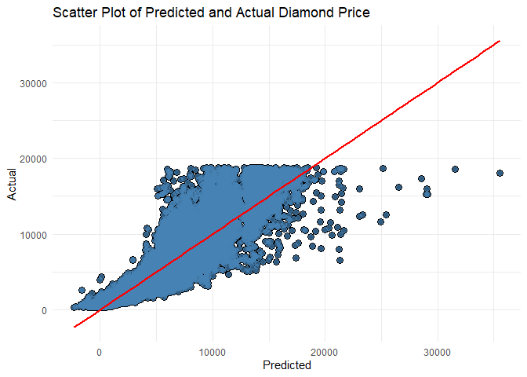

Practical Linear Regression - A case study on diamond prices
================
Josh Valdeleon

<br>

I’m still taking the **Regression Models** course of **John Hopkins
University** in **Coursera** but I already got motivated in writing my
first article in LinkedIn talking about a simple regression problem, and
I will use **R** as my tool for this analysis.

While taking that course, I realized something about business analytics.
Although it is so great comprehending the mathematical concepts and
theories behind these statistical models, your data-driven insights
**must** be presented in **<u>simple terms</u>**. I had this realization
when Prof. Brian Caffo talked a lot of equations with those fancy Greek
letters you’d typically use for mathematical equations, and I was like
yawning and did my best to understand the concepts by coding in R.

So, this article is primarily for people like me who don’t hate math but
would like to see the practical applications of statistical models first
with a little math (but still would want to learn the mathematical
concepts behind it). I will just talk about linear regression, and we’ll
try to uncover how its coefficients and variables are interpreted in the
simplest way that I can. I would also hope that one or couple of people
would start programming in R after reading this article. After taking
several R courses, I started to prefer this language more than Python
when it comes to statistical analysis.

<br>

### Practical Linear Regression

**[Linear
Regression](http://www.stat.yale.edu/Courses/1997-98/101/linreg.htm#:~:text=Linear%20regression%20attempts%20to%20model,to%20be%20a%20dependent%20variable.)**
is a statistical technique that tries to model the relationship between
the response (denoted by \(y\)) and predictor variables (denoted by
\(x\)) by fitting the linear equation \(y = b_0 + b_1x\), where \(b_0\)
is the *intercept* and \(b_1\) is the *slope* of the line (we’ll
understand this further later). It is used when we want to know how a
variable can affect another variable, and if we want to predict an
outcome based on a specific predictor value.

For example, if we want to see the **approximated weight in kilograms**
we gain for <u>every centimeter increase in height</u>, then we can use
linear regression. The approximated value for the slope is what we want
to answer this question. For prediction, if we have the approximated
values of the slope and intercept, we can plug these into the linear
equation and just do the arithmetic to get the estimated value of the
outcome based on a predictor.

<br>

### A case study on diamond prices

We will analyze the `diamonds` dataset that’s part of **ggplot2**
package in R. This dataset contains over 50,000 records with 10
variables that include `price`, `carat`, `cut`, `color`, and so on. See
the documentation in this
[link](https://ggplot2.tidyverse.org/reference/diamonds.html).

We want to understand how some of the variables affect the price of a
diamond. Specifically, we want to know how the price of a diamond
changes for every carat increase, for different cuts, and from different
levels of depth and table. For the sake of understanding the linear
regression model, we want to see if the coefficients that we’ll produce
are statistically significant, and if the model that we’ll create is a
good one.

<br>

### Data wrangling

The `diamonds` dataset is already neat. All I really have to do is
inspect it and customize it for this analysis. Let’s take a look at the
first few rows. I stored the data in variable called `df` to save us
some typing.

``` r
head(df)
```

    ## # A tibble: 6 x 10
    ##   carat cut       color clarity depth table price     x     y     z
    ##   <dbl> <ord>     <ord> <ord>   <dbl> <dbl> <int> <dbl> <dbl> <dbl>
    ## 1 0.23  Ideal     E     SI2      61.5    55   326  3.95  3.98  2.43
    ## 2 0.21  Premium   E     SI1      59.8    61   326  3.89  3.84  2.31
    ## 3 0.23  Good      E     VS1      56.9    65   327  4.05  4.07  2.31
    ## 4 0.290 Premium   I     VS2      62.4    58   334  4.2   4.23  2.63
    ## 5 0.31  Good      J     SI2      63.3    58   335  4.34  4.35  2.75
    ## 6 0.24  Very Good J     VVS2     62.8    57   336  3.94  3.96  2.48

As we’ve defined in our objectives, we’ll only need `carat`, `cut`,
`depth`, and `table` as predictor variables to see their relationships
with the diamonds price. So, we’ll just keep these variables. In
addition, we’ll transform the `cut` variable into numeric ordered factor
(*note that we can still use factor vectors with character values for
analysis in R*).

``` r
## Select needed columns and change the cut variable into numeric factors
df <- df %>% 
  select(price, carat, cut, depth, table) %>%
  mutate(cut = factor(as.numeric(cut)))

## Display the first few rows
head(df)
```

    ## # A tibble: 6 x 5
    ##   price carat cut   depth table
    ##   <int> <dbl> <fct> <dbl> <dbl>
    ## 1   326 0.23  5      61.5    55
    ## 2   326 0.21  4      59.8    61
    ## 3   327 0.23  2      56.9    65
    ## 4   334 0.290 4      62.4    58
    ## 5   335 0.31  2      63.3    58
    ## 6   336 0.24  3      62.8    57

<br>

### Building our simple model

Before getting into a complex model, let’s start from the most simple
one. One of the few equations that I’ll show you is the simple linear
equation (I’ve presented this earlier) which is \(y = b_0 + b_1x\),
where \(y\) is our response or outcome variable, \(x\) is our predictor,
\(b_1\) is our slope, and \(b_0\) is our intercept. In R, we only to
need plug in the \(x\) and \(y\) variables because R will do the work
for us to solve for \(b_0\) and \(b_1\). Using our `diamonds` dataset,
let’s create the linear regression model where our response variable is
the `price` and our predictor is `carat`.

``` r
## Create the x and y variables
x <- df$carat
y <- df$price

## Store the fitted model in fit variable
fit <- lm(y ~ x)

## Print the contents of fit variable
fit
```

    ## 
    ## Call:
    ## lm(formula = y ~ x)
    ## 
    ## Coefficients:
    ## (Intercept)            x  
    ##       -2256         7756

<br>

### Interpreting the coefficients

The **fit** variable gives us the intercept (\(b_0\)) and slope
(\(b_1\), the value below the `x` column).

Intercept is interpreted as the <b>value of \(y\) when \(x\) is 0</b>.
In our context, the price of a diamond having 0 carat is **-$2,256.00**.
Yes, this may not make sense but that’s how it’s interpreted. If we want
to get something out of it, we can mean-center our x variable, that is,
subtract the mean from the values, so that the intercept can be
interpreted as the <b>value of \(y\) when \(x\) is the average
carat</b>.

``` r
## Create the x and y variables
x <- df$carat - mean(df$carat) # the mean of x is now 0
y <- df$price

## Print the coefficients of the model
lm(y ~ x)
```

    ## 
    ## Call:
    ## lm(formula = y ~ x)
    ## 
    ## Coefficients:
    ## (Intercept)            x  
    ##        3933         7756

Based on above linear model, our slope is the same but our intercept is
now **$3,933**, which is read as the price of an average-carat diamond,
and this gives more valuable insight.

**Slope** tells us how \(y\) is affected by \(x\). The value that we got
is **7756**, which means that the value of a diamond increases by
**$7,756** for every **1 unit** increase of carat. If, let’s say, we got
a negative value, it’s interpreted as the **value deducted** from y for
every unit increase of x.

By substituting these values onto our equation (where \(x\) is not
mean-centered), we will get <b>\(y = -2256 + 7756x\)</b>. With this
equation, we can predict the estimated price of a diamond given a
specific carat size. For example, using this model, I want to get the
estimated amount of a 3.5-carat diamond. We can just replace x with the
given carat and do the math.

Solving for \(y = -2256 + (7756)(3.5)\), we’ll get **$24,890**. Our
model tells us that we could expect an estimated selling price of
**$24,890** from a **3.5-carat** diamond.

Please note that there is **confidence interval** assigned to linear
regression coefficients. Meaning, it’s never a guarantee that we will
get the exact price. Linear regression itself has uncertainties in it
which may have come from different external factors which could affect
the response variable. So, you might be asking, “*Can we rely to these
coefficients?*” This question can be answered numerically by the
invisible regression output that we will unfold.

<br>

### Interpreting other coefficients

Printing the `lm` object will only give us the values of slope and
intercept. If we use it as a parameter of `summary` function, we’ll get
more details.

``` r
## Get extra information from our lm object
summary(fit)
```

    ## 
    ## Call:
    ## lm(formula = y ~ x)
    ## 
    ## Residuals:
    ##      Min       1Q   Median       3Q      Max 
    ## -18585.3   -804.8    -18.9    537.4  12731.7 
    ## 
    ## Coefficients:
    ##             Estimate Std. Error t value Pr(>|t|)    
    ## (Intercept) -2256.36      13.06  -172.8   <2e-16 ***
    ## x            7756.43      14.07   551.4   <2e-16 ***
    ## ---
    ## Signif. codes:  0 '***' 0.001 '**' 0.01 '*' 0.05 '.' 0.1 ' ' 1
    ## 
    ## Residual standard error: 1549 on 53938 degrees of freedom
    ## Multiple R-squared:  0.8493, Adjusted R-squared:  0.8493 
    ## F-statistic: 3.041e+05 on 1 and 53938 DF,  p-value: < 2.2e-16

We got more results by from the `lm` object using `summary` function.
We’ll look into each of these to describe if the estimated
coefficients and the model itself is good.

**Residuals** are the differences between the actual and predicted
values of the response variable. Residuals portion simply tells us the
5-number summary of these differences. Here’s a small sample from our
data showing the residuals of the first 200 records.

``` r
df[1:200, c('carat', 'price')] %>% 
  mutate(predict = predict(fit)[1:200]) %>%
  ggplot(aes(carat, price)) + 
  geom_segment(aes(xend = carat, yend = predict)) +
  geom_point(size = 3, colour = 'blue') +
  geom_point(size = 2, colour = 'steelblue', alpha = 0.5) +
  geom_line(aes(y = predict), colour = 'red', size = 1) +
  labs(x = 'Carat', y = 'Price in US $', title = 'Residuals of first 200 records') +
  theme_minimal()
```

<!-- -->

So, the height between the red line (predicted \(y\)) and the blue dots
(actual \(y\)) is the residual.

**Coefficients** still give us the the estimated slope and intercept
values with extra details. We also get the **standard error**,
**t-value**, and **p-value** but we could center our attention to the
**p-value since** this is more of a better measure to say if the
estimated coefficients are statistically significant. P-values in
regression includes **hypothesis testing**. Our null hypotheses here are
<b>\(b_0=0\) and \(b_1=0\)</b>. In other words, these variables have no
effect to our response variable. The alternative hypotheses are
<b>\(b_0 \ne 0\) and \(b_1 \ne 0\)</b>, which means that our
coefficients indeed have an effect to our response variable, and this is
what we want. The p-values will tell if we can reject the null
hypotheses. If we have a value that’s less than 0.05, then we can reject
it. Based on regression summary, our p-value for both coefficients is
**\<2e-16**, that is **0.0000000000000002** and is obviously way lower
than 0.05. So, we reject the null hypothesis of these coefficients being
equal to 0, and this means that the values of our coefficients are
statistically significant.

**Residual standard error** is the standard deviation of the residuals.
We would want these values to be lower for better prediction.

**Multiple R-squared** and **Adjusted R-squared** are our goodness of
fit measures. These tell us the proportion of the variations on the
\(y\) variable which were explained by the model. It ranges from 0 to 1,
and we want these measures to be high. Although these have the same
values, we should just focus on the **adjusted r-squared** as this
measure is sensitive to irrelevant variables, while **multiple
r-squared** is not.

<br>

### Output in a glance

Okay, so that maybe heavy (maybe not), but just to summarize the
regression output, first, you need to identify your purpose of using
this model as this will determine which part of the output to focus on.

If your goal is to see the relationship between the variables and to see
if that relationship is statistically significant, then focus on the
**coefficients’ values** and **p-values**. Before checking the values,
look at the p-values if it tells us that what we got is statistically
significant or not. In case you got a low p-value in a multiple
regression but you don’t agree with it as you know your data pretty
well, then you might need to do a [multicollinearity
test](https://www.investopedia.com/terms/m/multicollinearity.asp) to see
if some of your \(x\) variables are highly correlated. These variables
could lead to misleading regression results.

If your aim is to predict the \(y\) value given an \(x\) value, then,
look at the **Adjusted R-squared** to see how your model works for
prediction. Set a threshold as to how much R-squared you want your model
to get to be considered as a good model, and to be used as a
recommendation to the business.

<br>

### Interpreting linear regression on diamonds dataset

``` r
df %>%
  select(carat, price) %>%
  ggplot(aes(carat, price)) +
  geom_point(colour = 'steelblue', size = 2, alpha = 0.5) +
  geom_smooth(method = 'lm', colour = 'red') +
  labs(x = 'Carat', y = 'Price in US $', 
       title = 'Scatter Plot of Diamond Carat and Price with Regression Line') +
  ylim(0, 20000) +
  theme_minimal()
```

    ## `geom_smooth()` using formula 'y ~ x'

    ## Warning: Removed 38 rows containing missing values (geom_smooth).

<!-- -->

Now that we know which values to look at, let’s summarize our simple
regression model on `diamonds` dataset. Recall that our regression model
with coefficient values is \(y = -2256 + (7756x)\). Our coefficients
have a p-value of **\<2e-16** which is lower than the threshold of 0.05.
Our multiple and adjusted R-squared are both **0.8493**, which is fairly
high. So, this simple linear regression model is considered a good
model. The calculated values of its coefficients are statistically
significant, which helps us identifying the magnitude of the
relationship of carat and price. The model itself can be trusted with
predicting diamond prices given any x values that are not in the
observed data.

After this, other factors need to be considered. We could look for ways
on how to reduce the residuals, and identify ways of increasing the
R-squared. This can be managed by identifying how we can deal with
outliers, adding new variables to the model, or maybe we could use other
models to see if those could be better for this analysis.

### Multiple linear regression on diamonds dataset

Since we’re done understanding the concepts of this statistical
technique by going through a simple linear regression example, let’s go
back to our case study’s objectives and use the rest of the variables to
construct a multiple linear regression model using the same diamonds
dataset. Here’s the code that I wrote.

``` r
## Store the model in fit variable
fit2 <- lm(price ~ carat + cut + depth + table, df)

## Print the regression output
summary(fit2)
```

    ## 
    ## Call:
    ## lm(formula = price ~ carat + cut + depth + table, data = df)
    ## 
    ## Residuals:
    ##      Min       1Q   Median       3Q      Max 
    ## -17513.5   -786.6    -39.9    521.4  12596.8 
    ## 
    ## Coefficients:
    ##             Estimate Std. Error t value Pr(>|t|)    
    ## (Intercept) 3292.648    481.126   6.844  7.8e-12 ***
    ## carat       7890.772     14.047 561.745  < 2e-16 ***
    ## cut2         985.700     44.403  22.199  < 2e-16 ***
    ## cut3        1305.112     42.458  30.739  < 2e-16 ***
    ## cut4        1224.606     42.554  28.777  < 2e-16 ***
    ## cut5        1506.096     44.050  34.190  < 2e-16 ***
    ## depth        -73.691      5.302 -13.898  < 2e-16 ***
    ## table        -41.816      3.881 -10.775  < 2e-16 ***
    ## ---
    ## Signif. codes:  0 '***' 0.001 '**' 0.01 '*' 0.05 '.' 0.1 ' ' 1
    ## 
    ## Residual standard error: 1508 on 53932 degrees of freedom
    ## Multiple R-squared:  0.8571, Adjusted R-squared:  0.8571 
    ## F-statistic: 4.62e+04 on 7 and 53932 DF,  p-value: < 2.2e-16

Before we interpret these, you might wonder why there are many
coefficients for `cut` variable. As we have mentioned earlier, cut
variable is an ordered factor variable, a categorical data in
statistical terms. Categorical data is dealt differently in regression
models. What happens in the backend is that R transforms the categorical
variable into sets of **binary variables**, which is just 1’s and 0’s
(think of it as 1 for true and 0 for false). R will create extra
variables to represent the values that we have in the original variable
with one value which will be used as a **reference**. In our case, cut
variable has 5 categories. R just produced 4 variables because the first
level of the ordered factor was used as reference. The values for cut
variable are **fair**, **good**, **very good**, **premium**, and
**ideal**, and they were transformed into numerical ordered factors and
now are being represented by 1, 2, 3, 4, and 5 respectively. Fair cut or
level 1 was used as reference value so there is no column for it. If all
of these cut variables are 0, then it means that the type of cut for a
particular observation is **fair**. This technique is called **dummy
coding**. Read more about dummy variables in
[Wikipedia](https://en.wikipedia.org/wiki/Dummy_variable_\(statistics\)).

**Coefficients**. Let’s now look at our coefficients. Our intercept is
**3292.648**. It is interpreted as the value of y when all x variables
is 0. But there’s now an additional interpretation here since we have a
categorical variable in our model. Remember that because of dummy
coding, fair cut is no longer included in the regression model. And we
mentioned earlier that if cut2 to cut5 are 0, then the type of cut for a
particular observation is **fair**. So, our intercept is interpreted as
the **price of a diamond when the type of cut is fair, all other
variables being 0**.

The slope for carat is **7890.772** and read as increase in price of a
diamond for every carat increase. The values of slope for the cut
variable are **985.7**, **1305.112**, **1224.606**, and **1506.096**.
These are the price increase of a diamond when the cut is **good**,
**very good**, **premium**, and **ideal** respectively. For fair cut, we
just have to go back to our intercept. The slope of **depth** and
**table** is **-73.691** and **-41.816** respectively. These values are
interpreted as the amount deducted from the price of a diamond per unit
increase of depth and table. Our coefficients are all less than 0.05
which proves that the values that we got are statistically significant.

Let’s also take a look at our new model in equation form.

\(y = b_0 + b_1x_1 + b_2x_2 + b_3x_3 + b_4x_4 + b_5x_5 - b_6x_6 + b_7x_7\),
where \(y\) is the response variable which is price, \(b_0\) is the
intercept, the \(x_n\) variables are carat, cut (\(x_2\) to \(x_5\) are
for cut2 to cut5), depth, and table, and \(b_1\) to \(b_7\) are the
corresponding slope of the \(x\) variables. Let’s test this.

Assume that we have a 0.30-carat diamond with an ideal cut, depth of 62,
and 54 table size. Using the model, what is the estimated price of this
diamond?

Let’s predict using the R function `predict.` Predict takes the `lm`
object as the first input and a new data frame with the corresponding
values.

``` r
## Plug the values into the predict function
predict(fit2, newdata = data.frame(carat=0.3, cut=factor(5), depth=62, table=54))
```

    ##        1 
    ## 339.0438

Using the predict function, we got **$339.04** as the estimated selling
price of a **0.30**-carat **ideal**-cut diamond with **62** depth and
**54** table size. These details actually came from the existing data
and per the diamonds dataset, the price of a diamond with these features
is **$348**. Not bad. We somehow got a close answer. Well done\!

``` r
df[, 'price'] %>% 
  mutate(predict = predict(fit2)) %>% 
  ggplot(aes(predict, price)) +
  geom_point(colour = 'black', size = 3) + 
  geom_point(colour = 'steelblue', size = 2, alpha = 0.7) +
  geom_smooth(method = 'lm', colour = 'red') +
  labs(x = 'Predicted', y = 'Actual', 
       title = 'Scatter Plot of Predicted and Actual Diamond Price') +
  theme_minimal()
```

    ## `geom_smooth()` using formula 'y ~ x'

<!-- -->

<br>

### Summary

We’ve gone through a simple case study on diamonds dataset using linear
regression as our statistical technique. We interpreted the
coefficients, the scores, and almost all of the needed details from the
regression output with a business analytics standpoint. There’s a lot of
theories and concepts that we could learn from regression, and it would
be so great understanding those.

Here are some things that I want you to take after reading this article.

1.  Linear regression is a widely used statistical technique (or machine
    learning model) that is typically used to get the relationship of
    variables and to predict values using independent variables.

2.  The coefficients are just the estimates of the true coefficients
    which are always unknown. The p-values will tell if these estimates
    are statistically significant.

3.  Multiple R-squared and Adjusted R-squared are the goodness-of-fit
    measures of linear regression. Multiple R-squared always goes up
    when new variables are added, while the adjusted R-squared is
    sensitive to irrelevant variables.

4.  Having low R-squared doesn’t mean that your model is useless. There
    are still other details that can be acquired from the regression
    output.

5.  Linear regression has confidence intervals and uncertainties that
    may not be captured by the model. Hence, predicting an exact outcome
    may not be possible. In the case of diamonds, inflation can affect
    the price.

<br>

[LinkedIn](https://www.linkedin.com/in/josh-valdeleon-2a8984150/)

[Github](https://github.com/imjbmkz/r_repository)
