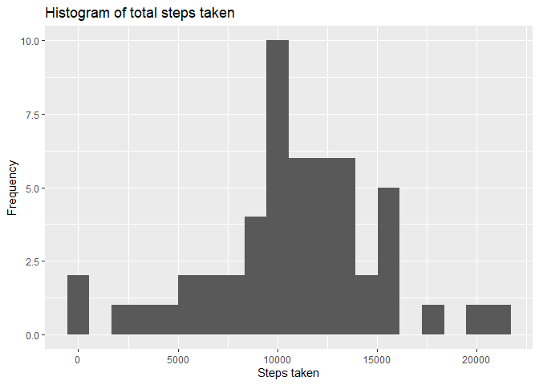
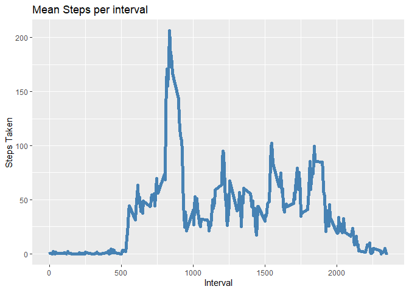
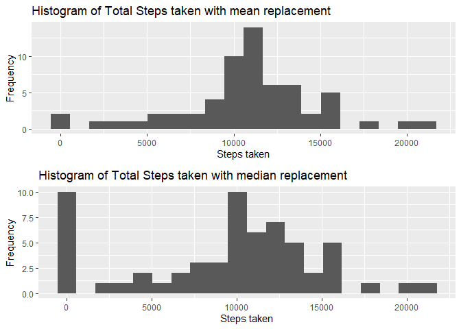
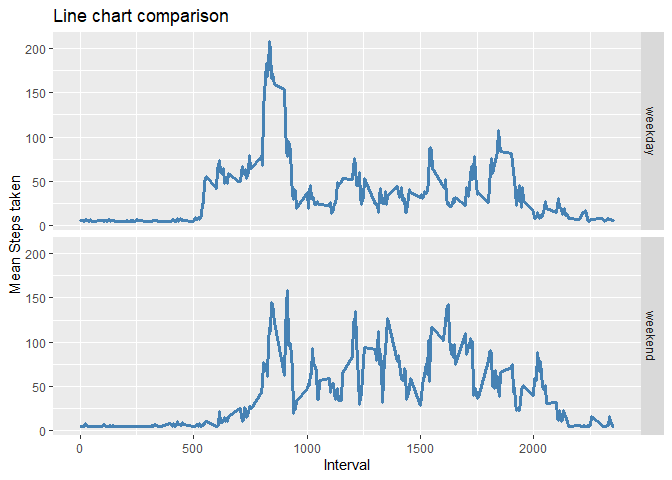

Reproducible Research Course Project 1
================
Josh Valdeleon
12/4/2020

## Reproducible Research Course Project 1

Submitted by: **Josh Valdeleon**

Date Committed: December 4, 2020

### Abstract

In this project, we will be working with the data on personal movements,
at the very least, we’ll work with the number of steps recorded with
**5-minute** interval from **October** to **November 2012**.

The data is stored in a comma-separated-value (CSV) file which can be
downloaded in this
[link](https://github.com/imjbmkz/RepData_PeerAssessment1/blob/master/activity.zip).
It consists of **17,568** observations and **3** variables. These
variables are as shown.

| Variable Name | Description                                                                       |
| ------------- | --------------------------------------------------------------------------------- |
| `steps`       | Number of steps taking in a 5-minute interval (missing values are coded as **NA** |
| `date`        | The date on which the measurement was taken in YYYY-MM-DD format                  |
| `interval`    | Identifier for the 5-minute interval in which measurement was taken               |

The analysis will revolve around answering couple of questions and
presenting some data visualizations which would help in understanding
further the data.

The only libraries used are **readr** to efficiently read large data,
**dplyr** for data manipulation, and **ggplot2** for data visualization.
These packages are all included in the **tidyverse** package.

All of the codes are stored in the R script called
`project1_solutions.R`. This script provides five functions which would
help answering the questions presented. I have sourced this script and
used these functions to answer the problems below. For more details, go
to `README.md` is this sub-directory.

``` r
source('project1_solutions.R')
```

    ## -- Attaching packages --------------------------------------- tidyverse 1.3.0 --

    ## v ggplot2 3.3.2     v purrr   0.3.4
    ## v tibble  3.0.4     v dplyr   1.0.2
    ## v tidyr   1.1.2     v stringr 1.4.0
    ## v readr   1.4.0     v forcats 0.5.0

    ## -- Conflicts ------------------------------------------ tidyverse_conflicts() --
    ## x dplyr::filter() masks stats::filter()
    ## x dplyr::lag()    masks stats::lag()

### Loading and Pre-Processing the data

Let’s read the data and store it in variable `x`.

``` r
x <- get_data()
```

    ## 
    ## -- Column specification --------------------------------------------------------
    ## cols(
    ##   steps = col_double(),
    ##   date = col_date(format = ""),
    ##   interval = col_double()
    ## )

Let’s quickly examine the data.

``` r
print(names(x)) # gives the column names
```

    ## [1] "steps"    "date"     "interval"

``` r
print(dim(x)) # gives the number of observations and variables
```

    ## [1] 17568     3

``` r
print(str(x)) # gives the 'structure' of the data
```

    ## tibble [17,568 x 3] (S3: spec_tbl_df/tbl_df/tbl/data.frame)
    ##  $ steps   : num [1:17568] NA NA NA NA NA NA NA NA NA NA ...
    ##  $ date    : Date[1:17568], format: "2012-10-01" "2012-10-01" ...
    ##  $ interval: num [1:17568] 0 5 10 15 20 25 30 35 40 45 ...
    ##  - attr(*, "spec")=
    ##   .. cols(
    ##   ..   steps = col_double(),
    ##   ..   date = col_date(format = ""),
    ##   ..   interval = col_double()
    ##   .. )
    ## NULL

By the above functions, we’ve seen the data types of these columns, its
size, and some `NA`s. We’ll not touch these for now as it will be
addressed during question number three.

### Question 1: What is mean total number of steps taken per day?

``` r
q1 <- question_one(x)
```

    ## `summarise()` ungrouping output (override with `.groups` argument)

The function above is still part of the script that I sourced. `q1` is a
list with 4 named-attributes. Let’s call the ggplot object from this
variable. It’s called `my_hist`.

``` r
q1$my_hist
```

<!-- -->

The histogram shows us the distribution of the values in `steps`
variable of our dataset. This is after removing all `NA`s from it. It
looks close to a normal distribution which can be proved by the mean and
median of this dataset.

``` r
print(paste('The mean is', round(q1$my_mean, 2)))
```

    ## [1] "The mean is 10766.19"

``` r
print(paste('The median is', q1$my_median))
```

    ## [1] "The median is 10765"

The mean and median are so close to each other. The mean and median of a
data that has a **normal distribution** are equal. Although ours aren’t
but they’re too close.

## Question 2: What is the average daily activity pattern?

``` r
q2 <- question_two(x)
```

    ## `summarise()` ungrouping output (override with `.groups` argument)

The time-series plot would helps us easily see which interval has the
highest mean steps across all days. It’s stored in the named item in
`q2` called `my_line`.

``` r
q2$my_line
```

<!-- -->

The peak of the line is on roughly **800th minute**. And to be more
precise, we simple call the second element of `q2` list, that is,
`my_max`.

``` r
q2$my_max
```

    ## # A tibble: 1 x 2
    ##   interval mean_steps
    ##      <dbl>      <dbl>
    ## 1      835       206.

Our estimate is correct, and the exact interval where we’ve seen the
highest mean steps across all intervals is on the **835<sup>th</sup>**
interval.

## Imputing missing values

``` r
q3 <- question_three(x)
```

    ## `summarise()` ungrouping output (override with `.groups` argument)

Let’s look at the rate of missing values per column of the original
dataset.

``` r
q3$na_prop
```

    ##     steps      date  interval 
    ## 0.1311475 0.0000000 0.0000000

The `steps` variable is the only column with missing values that is more
than 13% of the data. To address this, I tried to do two approaches. One
is to replace the `NA`s with the **mean** of this variable, and two is
to replace the same with the **median**.

The function `question_three()` mutates the data with two additional
columns with `NA` values replaced by mean and median. They are called
`mean_filled` and `median_filled`. Let’s look at the mean and median of
these two columns.

``` r
print('mean_filled')
```

    ## [1] "mean_filled"

``` r
print(str(q3$mean_filled))
```

    ## 'data.frame':    1 obs. of  2 variables:
    ##  $ mean  : num 10766
    ##  $ median: num 10766
    ## NULL

``` r
print('median_filled')
```

    ## [1] "median_filled"

``` r
print(str(q3$median_filled))
```

    ## 'data.frame':    1 obs. of  2 variables:
    ##  $ mean  : num 9354
    ##  $ median: num 10395
    ## NULL

From above output, we can see that the mean and median will become the
same if the `NA`s are replaced with the mean of the `steps` variable. On
the other hand, the mean becomes smaller than the median if these `NA`s
were replaced by the median. To visualize it, `q3` list has ggplot
objects called `mean_filled_hist` and `median_filled_hist` which will
display the histograms of `mean_filled` and `median_filled` variables.

``` r
gridExtra::grid.arrange(q3$mean_filled_hist, q3$median_filled_hist)
```

<!-- -->

We can see that this histogram proves the calculated mean and median of
`mean_filled` since it looks like (and numerically speaking, it is) a
**normal distribution**. The `median_filled` variable looks like a
**bimodal** one. In many statistical analyses, a normal distribution
would be much easier to model than other distributions. So, in the next
question, we’ll replace the `NA`s with the mean steps.

## Are there differences in activity patterns between weekdays and weekends?

``` r
q4 <- question_four(x)
```

    ## `summarise()` regrouping output by 'day_category' (override with `.groups` argument)

`question_four()` function replaces `NA`s in the `steps` variable, and
adds a new column that categorizes the date if it is a weekday or a
weekend. The data is then grouped by this category and by interval, and
summarized by the mean steps.

Let’s visualize the trend of the mean steps per interval, and we’ll
group it by day category.

``` r
q4$my_line
```

<!-- -->

From the above time-series plot, I would say that generally, the trend
is similar. The person is much more active, that is, taking more steps
roughly at **800<sup>th</sup>** minute. The difference between them is
that the person is much more active during weekends since there are many
intervals after 1000<sup>th</sup> were s/he exceeded 100 steps versus
that of the weekdays where s/he only had one instance of reaching 100
steps.

This could mean that maybe the person during weekdays, which is
obviously his/her workdays, might always be at his/her desk and just
walks when needed (for lunch, going to different meeting rooms, goes to
his/her officemates to have a little chit-chat, etc). While on the
weekend, that his/her time to go on a trip or elsewhere to have fun.
