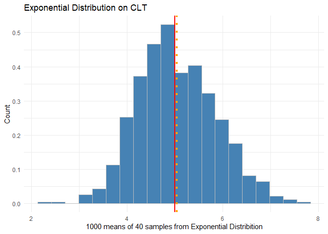
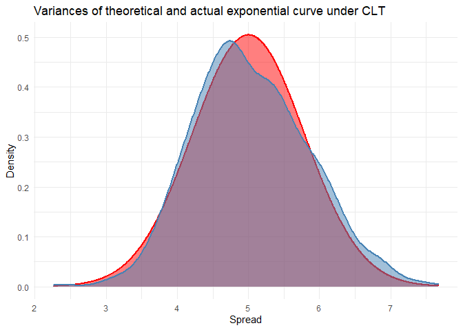
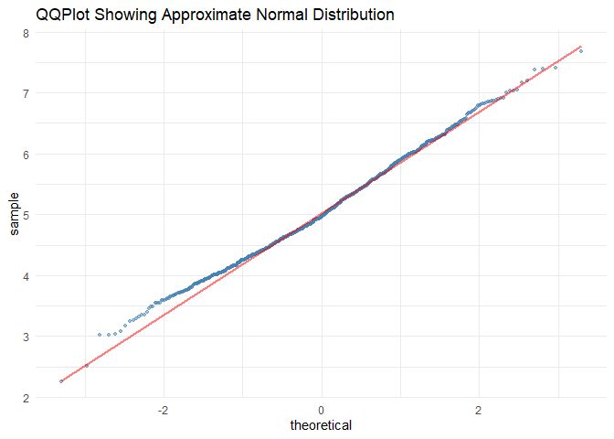
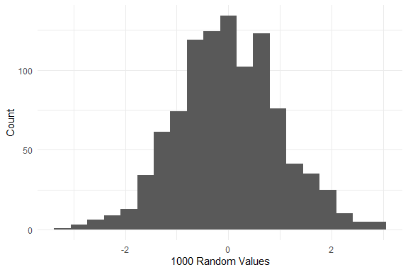
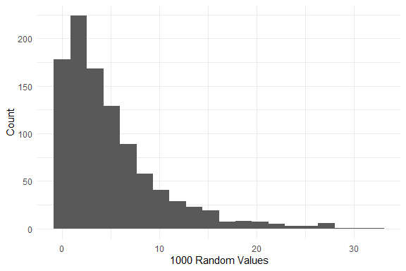

Simulations on Distribution
================

This is the first part of the final project for the course **Statistical
Inference** by **JHU** in **Coursera**.

<br>

In this project, we will simulate the **exponential distribution** and
compare it with the **Central Limit Theorem (CLT)**. As mentioned by
Prof. Brian Caffo (2016), “*CLT states that the distribution of averages
of iid variables becomes that of a standard normal as the sample size
increases*”. The “*standard normal*” is that of a bell-curve
shaped[<sup>\[1\]</sup>](#bellcurve).

Taboga (2020) described **exponential distribution** as a *continuous
probability distribution used to model the time we need to wait before a
given event occurs*. This is pretty self-explanatory but to make an
analogy out of it, imagine that this is the number of minutes left
before a bomb explodes. So, distribution’s shape should be like a
downward trend[<sup>\[2\]</sup>](#expcurve).

In this simulation, we want to see the difference between the
**theoretical mean** and **theoretical variance** of an exponential
distribution and its **actual mean** and **actual variance** when we’ve
taken **40** samples from an exponential distribution, take their mean,
and do that process by a thousand times.

<br>

#### Comparing Means

First, let’s define the theoretical mean and variance of an exponential
distribution. We will use the R function `rexp` that takes two
arguments. The first argument is the number of random number and the
second argument is the rate or lambda (\(\lambda\)). Our \(\lambda\) in
this study is **0.2**. The mean and standard deviation of an exponential
distribution is \(1 /\lambda\).

``` r
theo <- 1 / 0.2 
cat('Theoretical mean: ', theo, '\nTheoretical standard deviation: ', theo)
```

    ## Theoretical mean:  5 
    ## Theoretical standard deviation:  5

<br>

We can then directly create the histogram of 1 thousand simulations of
40 random samples from an exponential distribution.

``` r
set.seed(40000)
means <- NULL
for (i in 1:1000) means[i] <- mean(rexp(40, 0.2))
ggplot() + 
  geom_histogram(aes(x = means, y = ..density..), 
                 bins = 20, col = 'grey', fill = 'steelblue') + 
  labs(x = '1000 means of 40 samples from Exponential Distribition', 
       y = 'Count', title = 'Exponential Distribution on CLT') +
  geom_vline(xintercept = theo, color = 'red', size = 1) +
  geom_vline(xintercept = mean(means), color = 'orange', 
             size = 1.5, linetype = 'dotted') + 
  theme_minimal()
```

<!-- -->

The above histogram shows us the means of 40 random samples from an
exponential distribution which is done 1000 times. As we can see, the
shape is close to a bell-curve that is used to portray a normal
distribution. Looking at the values, the actual mean (orange dotted
line) 5.05 is so close to the theoretical mean (red line) of 5.

<br>

#### Comparing Variances

Let’s now look on the theoretical and actual variances.

``` r
theo_var <- (1 / 0.2) ^ 2 / 40
act_var <- var(means)
cat('Actual variance: ', act_var, '\ntheoretical variance', theo_var)
```

    ## Actual variance:  0.6524401 
    ## theoretical variance 0.625

The values are still close to each other. Let’s now visualize it.

``` r
xnorm <- seq(min(means), max(means), length = 1000)
ynorm <- dnorm(xnorm, mean = 5, sd = 1/0.2/sqrt(40))
ggplot() + 
  geom_area(aes(x = xnorm, y = ynorm), size = 1, col = 'red', 
            fill = 'red', alpha = 0.5) + 
  geom_density(aes(x = means), size = 1, col = 'steelblue', fill = 'steelblue', 
               alpha = 0.5) + 
  theme_minimal() +
  labs(x = 'Spread', y = 'Density', 
       title = 'Variances of theoretical and actual exponential curve under CLT')
```

<!-- -->

We can see from above densities that the two are so close to each other
which means that the two are not that too variable when compared with
each other.

<br>

#### Distribution

Let’s now see if the distribution of our simulation is really close to a
normal distribution.

``` r
ggplot() + 
  stat_qq(aes(sample = means), col = 'steelblue', size = 1, alpha = 0.5) + 
  stat_qq_line(aes(sample = means), col = 'red', size = 1, alpha = 0.5) +
  labs(title = 'QQPlot Showing Approximate Normal Distribution') + 
  theme_minimal()
```

<!-- -->

The above shows us that dots and the line somehow forms a line which
means that it follows the same distribution.

<br>

### References

Cafo, B. (2016). ***Statistical Inference for Data Science***. Leanpub

Taboga, M. (2020). ***Exponential Distribution***. StatLect.
<https://www.statlect.com/probability-distributions/exponential-distribution>.
Retrieved: December 12, 2020.

<br>

### Appendix

#### **Normal Distribution Curve**

<!-- --> <br>

#### **Exponential Distribution Curve**

<!-- -->
