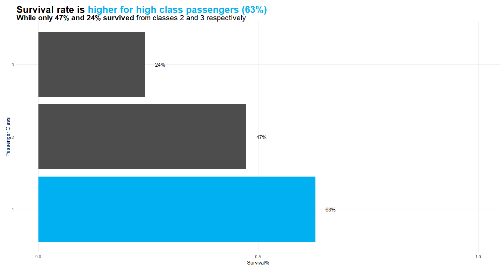
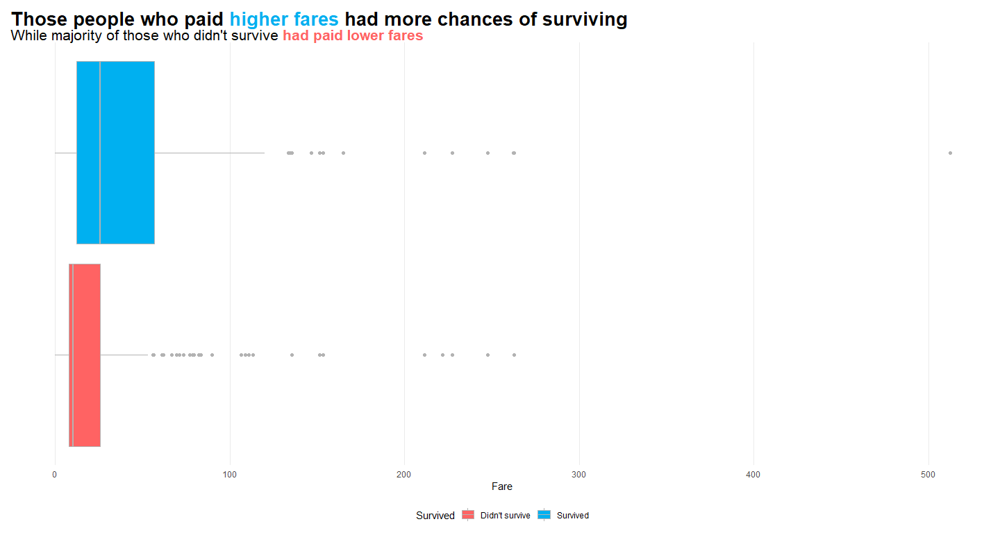
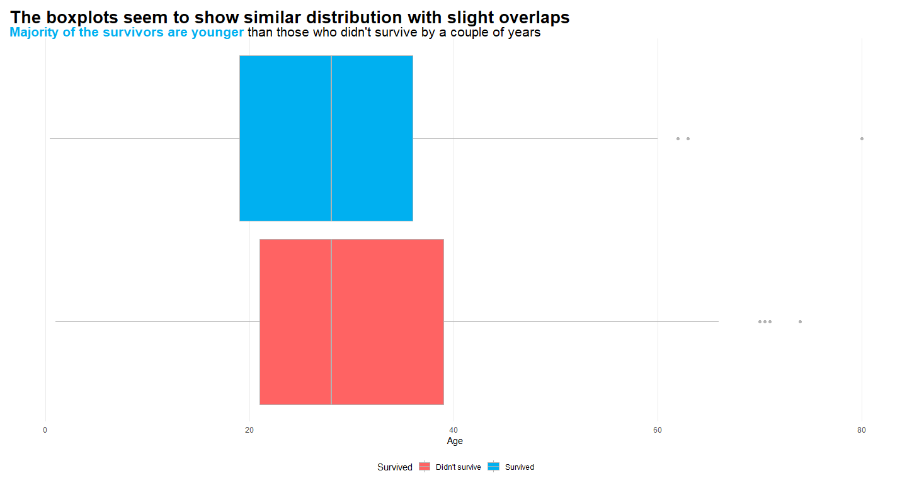
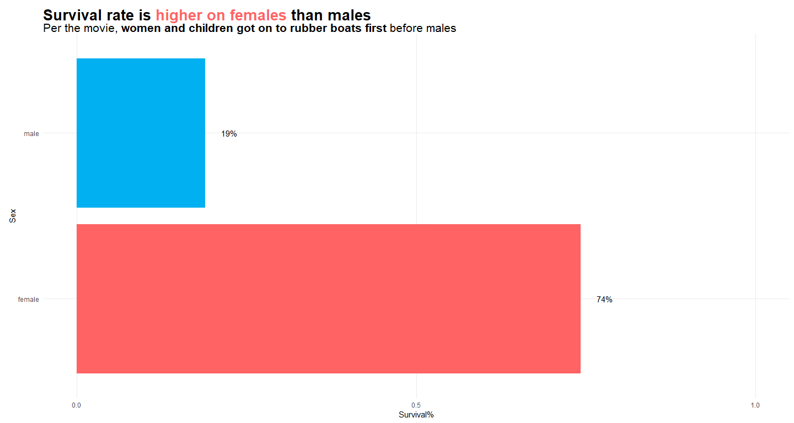
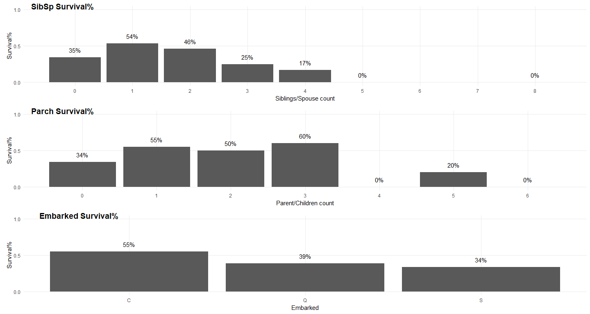
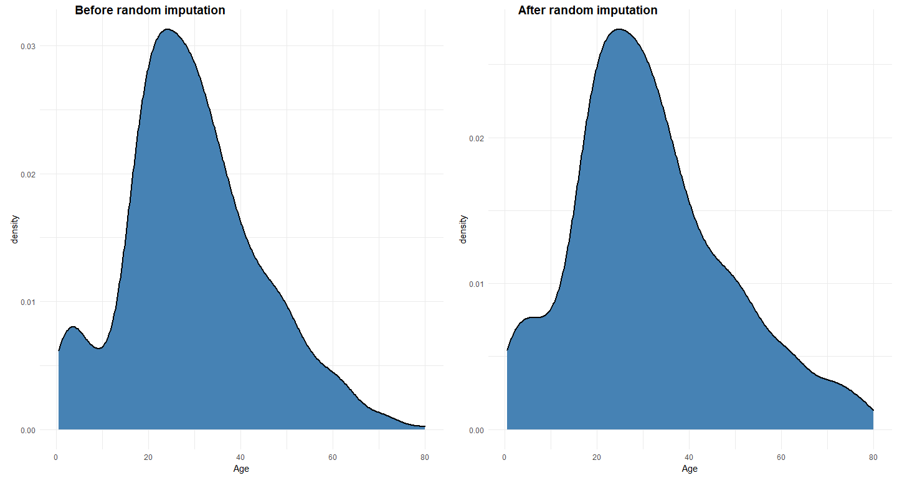
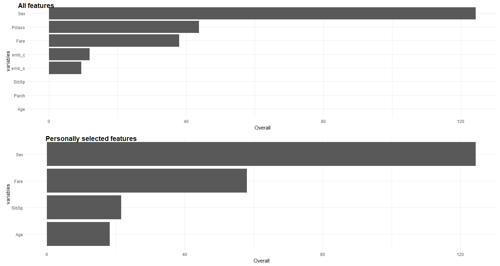
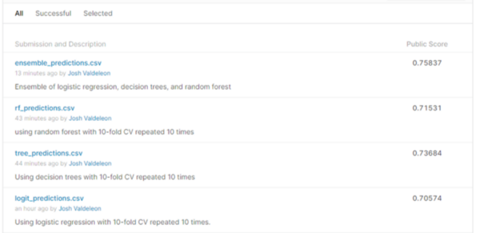

How to save a life? Titanic edition
================

Around April 1912, you onboarded the famous **RMS Titanic cruise
liner**. Along with other 2,200+ passengers, you enjoyed the few days
you’d spent in that massive and elegant ship until one night, it started
sinking to the bottom of the North Atlantic Ocean. You’re so scared as
you don’t know if you’d survive or get drowned or freeze to death. You
fell off from the gigantic ship into the ocean—and that wakes you up.
“***Phew!***” It was all just a dream, and you’re living in 2021’s
climate crisis and pandemic.

 

You heard on the news that scientists and engineers are testing the time
machine they’re developing. With high hopes, traveling back in time
would be possible by 2060s. As a healthy 24 year old guy, you have some
confidence that you’ll still be alive by then and that you’ll get to
travel back in time. As an aspiring data scientist, you thought of
analyzing the Titanic passengers’ data to assess which features would
help people to survive from the sinking ship. *Of course, you thought of
telling everyone that Titanic will sink on 1912 April 15th, but who will
believe a “prophetic” weird looking man telling them what will happen in
the future? So you thought of a little bit more logical way to help
them —***give them the statistics on passengers’ survival from a sinking
boat**.

 

> “Data is the new oil. Does that mean that it will also give the same
> problems that oil had caused?” — *Unknown (actually, mine but maybe
> someone had already said it)*

 

### About the data

    ## # A tibble: 891 x 9
    ##    PassengerId Survived Pclass Sex      Age SibSp Parch  Fare Embarked
    ##          <dbl>    <dbl>  <dbl> <chr>  <dbl> <dbl> <dbl> <dbl> <chr>   
    ##  1           1        0      3 male      22     1     0  7.25 S       
    ##  2           2        1      1 female    38     1     0 71.3  C       
    ##  3           3        1      3 female    26     0     0  7.92 S       
    ##  4           4        1      1 female    35     1     0 53.1  S       
    ##  5           5        0      3 male      35     0     0  8.05 S       
    ##  6           6        0      3 male      NA     0     0  8.46 Q       
    ##  7           7        0      1 male      54     0     0 51.9  S       
    ##  8           8        0      3 male       2     3     1 21.1  S       
    ##  9           9        1      3 female    27     0     2 11.1  S       
    ## 10          10        1      2 female    14     1     0 30.1  C       
    ## # ... with 881 more rows

Thanks to the internet, you managed to get several details about the
**1,309** **Titanic passengers**. For the event that happened centuries
ago, it’s cool that you still have enough passenger-level information
that’s fairly clean. Of course, there are missing values and variables.
You have **418 samples** with missing survival status. With the help of
[Kaggle](https://www.kaggle.com/c/titanic), you’ll get to test your data
analysis skills to measure people’s chances of surviving from that
catastrophic event through prediction (*which we can call scientific
fortune-telling*).

 

### Exploratory Data Analysis

Couple of days after that dream of being one of the
fortunate/unfortunate passengers of RMS Titanic, you finally got some
initial results from your analysis!

 

#### On passenger class.

<!-- -->

Your hunch is a *little* true. **People from higher classes had higher
survival%**. Survival% can be thought of as the probability of surviving
from the sinking Titanic ship given a specific class. We denote this by
*P*(*S*\|*C**n*), which is read as “*the probability of
surviving given class n*”. So, *P*(*S*\|*C*1)=63%,
*P*(*S*\|*C*2)=47%, while *P*(*S*\|*C*3)=24%.

 

#### On fares class.

<!-- -->

Visualizing the fares of the passengers gave you more evidence that
*with great power comes with great survival rate*. You can see from
these boxplots that **those who paid higher fare had more survivors than
those who paid less**. You may wonder, *what did someone get for paying
more than $500*? Well, that’s the [price for a first class
ticket](https://www.statisticalconsultants.co.nz/blog/titanic-fare-data.html).

 

> “Data is the new pollution. When data is not clean, it becomes a
> liability.”  
>  *— Dr. Dominic Ligot*

 

#### On age.

<!-- -->

Age doesn’t seem to be a great predictor of passenger’s survival.
Distribution of age grouped by survival status looks similar, although
by running a T-Test, you found out that on average, **those who survived
are younger by 2 years** than those who didn’t make it (1–5 years on 95%
confidence).

 

#### On sex.

<!-- -->

Females had the highest survival rate. **74% of the female passengers**
**survived** from the sinking ship while only **19% of the male
passengers made it**. You kinda watched the movie and you saw that
females and children went to the rubber boats first before males. This
is also called [**Birkenhead
Drill**](https://en.wikipedia.org/wiki/Women_and_children_first).
There’s also an interesting story of misunderstanding the captain’s
order where one officer interpreted it as “*women and children
**first**"* while the other officer thought of it as”*women and children
**only***", which could explain your recent findings from the age and
sex data.

 

#### **On number of siblings/spouse and parents/children aboard, and port of embarkation.**

<!-- -->

To summarize the final pieces of the data, **survival% generally
decreases as people bring more siblings/spouse aboard**, although it’s a
little weird why those with no siblings nor spouses had lower survival%.
Bringing your parents/children with you doesn’t visually say your
chances of surviving. You see that there’s no clear direction, and that
**survival is still a matter of chances for this aspect**. As for port
of embarkation, **passengers embarked from Cherbourg had the highest
survival%**, followed by Queenstown, and Southampton respectively
Although there are some clear distinctions, you are still doubtful on
whether port of embarkation is a good measure of survival (*just think
of it, will people ask you at which port you onboarded during a life and
death situation?*).

 

### Data Cleaning & Feature Selection

The above results were derived from the raw data. So, you went on
working with missing values and make some transformations.

 

#### **Imputing missing values.**

<!-- -->

You actually tried imputing values with mean and median age but that
drastically changed the distribution of this variable. You thought of
using complex methods, but you want to make it simple. So, you replaced
NAs with **random uniform values ranges from the actual minimum and
maximum values** of this variable, which you think is more sensible as
this reflects the real data that you have (with the assumption that data
are just *missing at random*). There are also **2 missing values** on
port of embarkation. You imputed them with the **mode** which is
Southampton. 

 

#### **Data transformation.**

You transformed sex variable to make it a numeric data. In your
transformation, 1 means *female* while 0 means *male*. You’ve also made
some dummy variables for port of embarkation. Finally, you converted
your outcome variable to **factor**.

 

#### **Feature selection.**

You had selected the features that you will use for your model. After
several brainstorming (*just with yourself*), you’ve removed passenger
id (*obviously, since this is just an identifier*), number of
parent/child aboard (*since per your EDA, survival% is not easy to be
identified using this*), port of embarkation (*you’re not that sold with
the idea that this can be a good predictor*), and passenger class (*you
will use fare instead, and fare will still tell which class you’re on*).
But you kept a copy of the cleaned and transformed dataset for
comparison purposes.

 

#### **Variable importance.**

<!-- -->

You trained two random forest models to get the variable importance. The
first model has all features while the second one has the features
you’ve hand-picked. Both models agree that **passenger’s sex is the most
important variable**, followed by **passenger class** (present only in
the first model), and **fare paid**. You want to account for the
findings you got from this test. Hence, in the model you will use for
prediction, you will just use the **passenger’s sex**, **fare paid**,
and **their class**.

 

> “*I love hasty generalization. This is just really telling you that
> you can’t measure a phenomena with 100% certainty.*” — Just me, making
> it look like a good quote

 

### Building the model

Okay, so you’re now on the final steps to save some people from the
elegant yet horrifying disaster. You will now build some classifiers to
see which one performs best.

 

#### Logistic regression.

    ## Confusion Matrix and Statistics
    ## 
    ##           Reference
    ## Prediction   0   1
    ##          0 226  86
    ##          1  48 188
    ##                                           
    ##                Accuracy : 0.7555          
    ##                  95% CI : (0.7173, 0.7909)
    ##     No Information Rate : 0.5             
    ##     P-Value [Acc > NIR] : < 2.2e-16       
    ##                                           
    ##                   Kappa : 0.5109          
    ##                                           
    ##  Mcnemar's Test P-Value : 0.001392        
    ##                                           
    ##             Sensitivity : 0.8248          
    ##             Specificity : 0.6861          
    ##          Pos Pred Value : 0.7244          
    ##          Neg Pred Value : 0.7966          
    ##              Prevalence : 0.5000          
    ##          Detection Rate : 0.4124          
    ##    Detection Prevalence : 0.5693          
    ##       Balanced Accuracy : 0.7555          
    ##                                           
    ##        'Positive' Class : 0               
    ## 

    ## Confusion Matrix and Statistics
    ## 
    ##           Reference
    ## Prediction  0  1
    ##          0 58 15
    ##          1 10 53
    ##                                           
    ##                Accuracy : 0.8162          
    ##                  95% CI : (0.7407, 0.8774)
    ##     No Information Rate : 0.5             
    ##     P-Value [Acc > NIR] : 1.97e-14        
    ##                                           
    ##                   Kappa : 0.6324          
    ##                                           
    ##  Mcnemar's Test P-Value : 0.4237          
    ##                                           
    ##             Sensitivity : 0.8529          
    ##             Specificity : 0.7794          
    ##          Pos Pred Value : 0.7945          
    ##          Neg Pred Value : 0.8413          
    ##              Prevalence : 0.5000          
    ##          Detection Rate : 0.4265          
    ##    Detection Prevalence : 0.5368          
    ##       Balanced Accuracy : 0.8162          
    ##                                           
    ##        'Positive' Class : 0               
    ## 

You ran a logistic regression and your model didn’t show any signs of
overfitting but the accuracy is below 80%. On training data (first
result), you got **75.55%** accuracy while on validation data (second
result), you got **81.62%**.

 

#### Decision tree.

    ## Confusion Matrix and Statistics
    ## 
    ##           Reference
    ## Prediction   0   1
    ##          0 272   3
    ##          1   2 271
    ##                                          
    ##                Accuracy : 0.9909         
    ##                  95% CI : (0.9788, 0.997)
    ##     No Information Rate : 0.5            
    ##     P-Value [Acc > NIR] : <2e-16         
    ##                                          
    ##                   Kappa : 0.9818         
    ##                                          
    ##  Mcnemar's Test P-Value : 1              
    ##                                          
    ##             Sensitivity : 0.9927         
    ##             Specificity : 0.9891         
    ##          Pos Pred Value : 0.9891         
    ##          Neg Pred Value : 0.9927         
    ##              Prevalence : 0.5000         
    ##          Detection Rate : 0.4964         
    ##    Detection Prevalence : 0.5018         
    ##       Balanced Accuracy : 0.9909         
    ##                                          
    ##        'Positive' Class : 0              
    ## 

    ## Confusion Matrix and Statistics
    ## 
    ##           Reference
    ## Prediction  0  1
    ##          0 57 19
    ##          1 11 49
    ##                                           
    ##                Accuracy : 0.7794          
    ##                  95% CI : (0.7003, 0.8459)
    ##     No Information Rate : 0.5             
    ##     P-Value [Acc > NIR] : 1.908e-11       
    ##                                           
    ##                   Kappa : 0.5588          
    ##                                           
    ##  Mcnemar's Test P-Value : 0.2012          
    ##                                           
    ##             Sensitivity : 0.8382          
    ##             Specificity : 0.7206          
    ##          Pos Pred Value : 0.7500          
    ##          Neg Pred Value : 0.8167          
    ##              Prevalence : 0.5000          
    ##          Detection Rate : 0.4191          
    ##    Detection Prevalence : 0.5588          
    ##       Balanced Accuracy : 0.7794          
    ##                                           
    ##        'Positive' Class : 0               
    ## 

Next, you’ve trained a decision tree model. It’s great that this
acquired **99.09%** accuracy rate on training data (first result), but
the validation set (second result) shows a clear sign of overfitting as
you only had **77.94%** accuracy. 

 

#### Random forest.

    ## Confusion Matrix and Statistics
    ## 
    ##           Reference
    ## Prediction   0   1
    ##          0 234  74
    ##          1  40 200
    ##                                           
    ##                Accuracy : 0.792           
    ##                  95% CI : (0.7555, 0.8252)
    ##     No Information Rate : 0.5             
    ##     P-Value [Acc > NIR] : < 2.2e-16       
    ##                                           
    ##                   Kappa : 0.5839          
    ##                                           
    ##  Mcnemar's Test P-Value : 0.001997        
    ##                                           
    ##             Sensitivity : 0.8540          
    ##             Specificity : 0.7299          
    ##          Pos Pred Value : 0.7597          
    ##          Neg Pred Value : 0.8333          
    ##              Prevalence : 0.5000          
    ##          Detection Rate : 0.4270          
    ##    Detection Prevalence : 0.5620          
    ##       Balanced Accuracy : 0.7920          
    ##                                           
    ##        'Positive' Class : 0               
    ## 

    ## Confusion Matrix and Statistics
    ## 
    ##           Reference
    ## Prediction  0  1
    ##          0 56 16
    ##          1 12 52
    ##                                           
    ##                Accuracy : 0.7941          
    ##                  95% CI : (0.7164, 0.8586)
    ##     No Information Rate : 0.5             
    ##     P-Value [Acc > NIR] : 1.392e-12       
    ##                                           
    ##                   Kappa : 0.5882          
    ##                                           
    ##  Mcnemar's Test P-Value : 0.5708          
    ##                                           
    ##             Sensitivity : 0.8235          
    ##             Specificity : 0.7647          
    ##          Pos Pred Value : 0.7778          
    ##          Neg Pred Value : 0.8125          
    ##              Prevalence : 0.5000          
    ##          Detection Rate : 0.4118          
    ##    Detection Prevalence : 0.5294          
    ##       Balanced Accuracy : 0.7941          
    ##                                           
    ##        'Positive' Class : 0               
    ## 

This is the last model that you fitted. On training set (left), you got
**79.20%** accuracy which is lower than the second model’s predictions,
but higher than the first one. On the validation set. you had **79.41%**
accuracy, which is an improvement but is still low.

 

> “*Never defend your model.*” — I’m just making some random statements.
> Maybe my name will be posted elsewhere for these quotes.

 

### Testing the model

So, after you’ve trained couple of models, you have generated some
predictions based from that 418 samples with no labeled output. This is
where Kaggle will help you. *Magically*, Kaggle will assess your
predictions and will give you the accuracy rate of your submission. You
have prepared four predictions: the first three are based from the
models that you’ve fit, and the last one was based on the ***ensemble***
of those models. The fourth predictions were made by *voting*. If **two
or more models** voted for a specific class, then the **prediction will
be in favor for that class**.

Using the 418 unlabeled test data, logistic regression gave you **70.57%
accuracy**, decision tree yielded **73.68%**, while for random forest,
it’s **71.53%**. Their combined predictions gave you **75.83%**. “*Geez!
So, if I’ll use my model to advise the 2,200+ Titanic passengers, I will
only be correct for roughly 1,650 of them. From the overall probability
(\~31%) of surviving that incident, my model may only save 512
passengers.*”

 

> “*If you can travel back in time, will you back to historic events to
> change it? But can you really change it?*”

 

### Farewell

Although the accuracy that you have from the unseen data is not
*generally* good, your analyses still yielded meaningful results. By the
time that you will travel back to 1912, you’ll bring these statistics to
inform the passengers about their chances of surviving should the
Titanic ship sinks (*but you know that it will*). Maybe they’ll ignore
and look down on you (*because your outfit would seem really odd for
them*), but at least, you gave them a warning (*you haven’t actually
thought if everyone knows modern English*). 

2060s is still far. So, you have plenty of time to make better models
that predict with better accuracy. Time travel may still be impossible
by then, so you could take your time as you develop better ways on how
to save more people (*if not, prevent that tragedy*).

Oh, you thought of a simpler way to avoid that incident. Look for Jack
and Rose and tell them not to kiss in that spot where they were seen by
the ship guard. He got distracted and didn’t see that incoming iceberg. 
